# Exercise 2 - Building RAG

## Estimated Duration: 30 Minutes

## Overview
In this excercise, you will build the Retrieval-Augmented Generation (RAG) model for your application. You will process and ingest data and configure the retrieval pipeline. This exercise will guide you through the steps required to implement and validate the RAG workflow.

## Lab Objectives
In this lab, you will perform the following:

- Task 1: Prepare and Ingest Data
- Task 2: Configure the RAG Pipeline

### Task 1: Prepare and Ingest Data

1. Navigate to Azure Portal, search for **Storage account (1)** and select the **Storage account (2)**.
    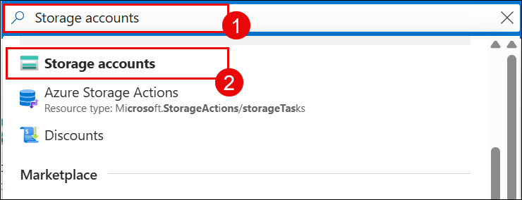

1. Select the Storage account named **storage**

    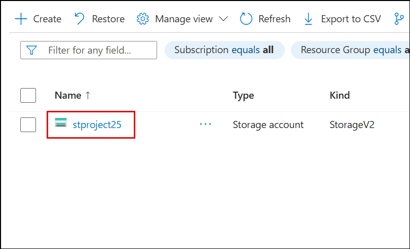

1. Click on **Containers(1)** under data storage, then click on **Content(2)**.

    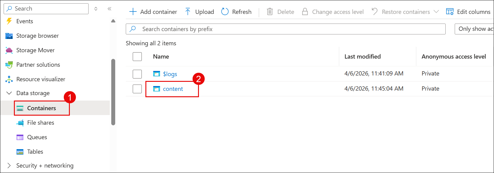

1. Click on **upload (1)** to upload the file and then Click on **Browse for files (2)**.

    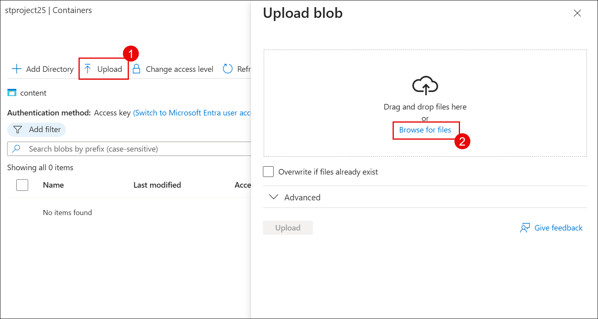

1. Navigate to **C:\LabFiles\azure-search-openai-demo\data (1)** and select all the PDFs to **upload (2)**, and **click on Open (3)**.

    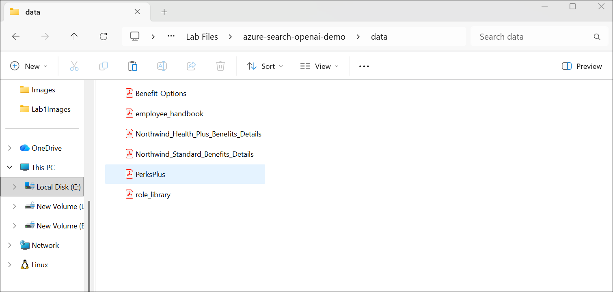

1. Click on **upload**.

    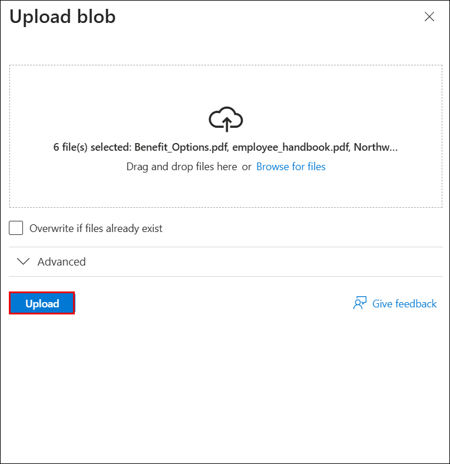

### Task 2: Configure the RAG Pipeline

1. Navigate to Azure Portal and search **AI Search** and select **ai-search-service (1)** in azure portal.

    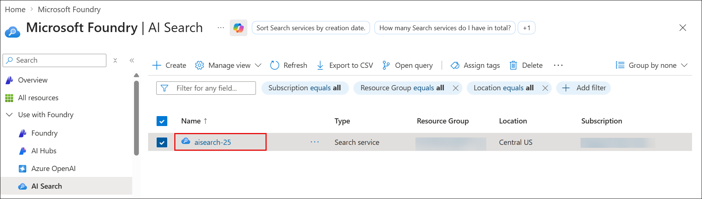
    
1. Click on **Import Data**

    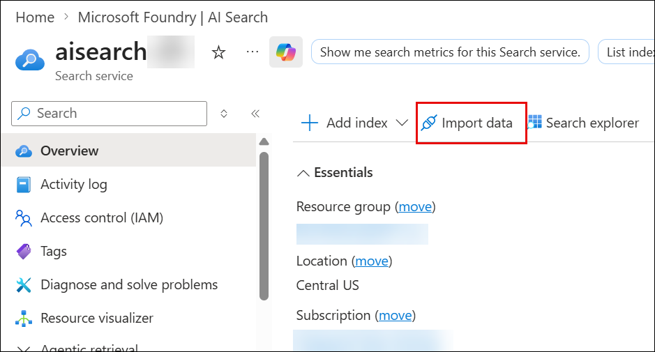

1. Select **Azure Blob Storage**.

    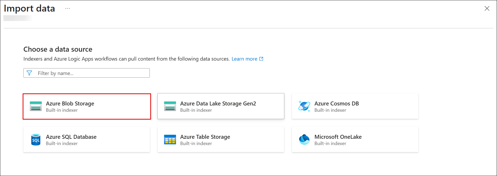

1. Choose **RAG Model**.

    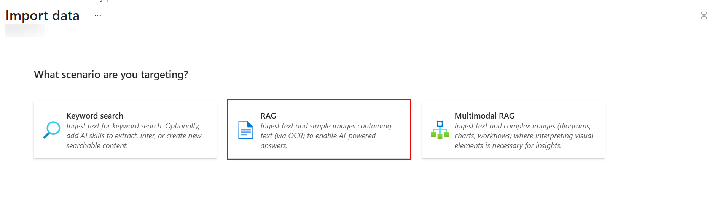

1. On Configure your Azure Blob Storage , enter the following details:

    - Subscription: **Default - Pre-assigned subscription (1)**
    - Storage account: **Select the Storage account named storage**
    - Blob container: **content (3)**
    - Parsing: **Default(4)**
    - Management identity type: **System-assigned(5)**

    - Click on **Next(6)**

    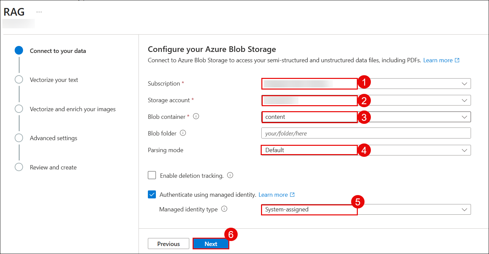

1. On Vectorize your text, enter the following details:

    - Kind: **Azure OpenAI (1)**
    - Subscription: **Leave it default (2)**
    - Azure OpenAI service: **openai-(3)**
    - Model deployment: **text-embedding-3-large (4)**
    - Authentication type: **System assigned identity (5)**
    - Acknowledgement **checked (6)**
    - click on **Next (7)**
    
     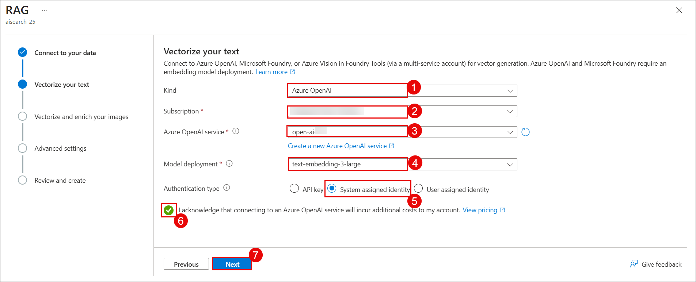

1. Click on Next twice.
    
    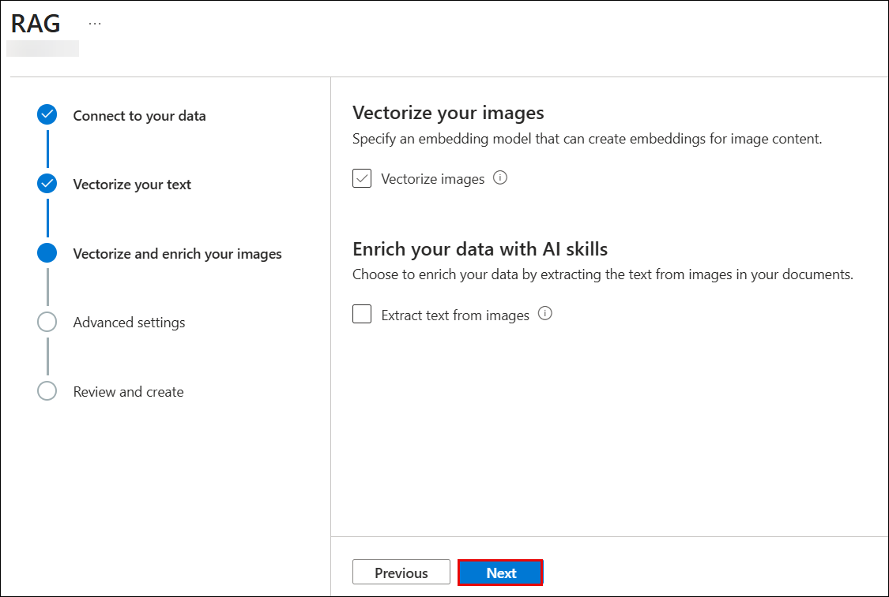
    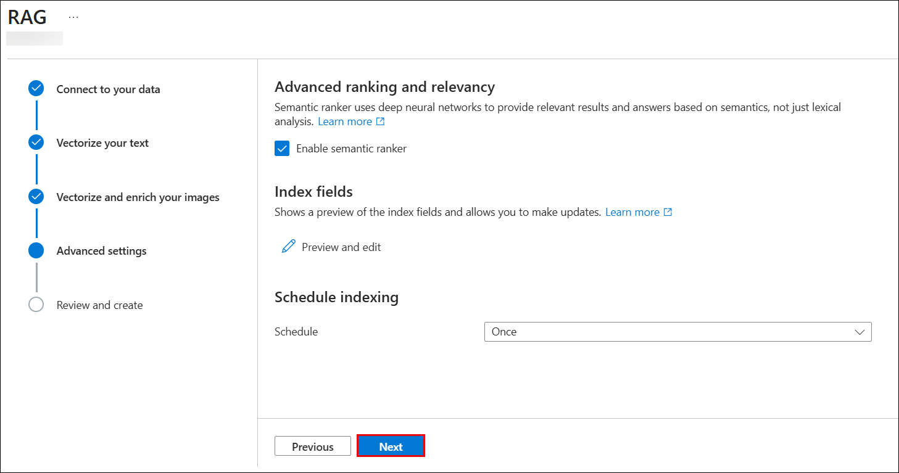

1. Enter **healthplan (1)** for Objects name prefix and click on **Create (2)**.

    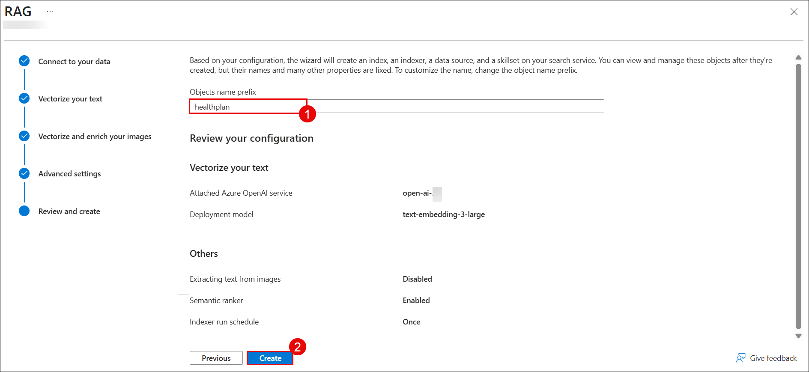

>**Note**: The uploading of data to indexes in search service might take 5-10 minutes.

>**Note:** On the **Create Suceeded** Pop Up click on close.

## Summary

In this lab, you have completed the following tasks:
- Ingest the data in Storage Account
- Configuring the RAG pipeline

### You have successfully completed the lab. Click on **Next >>** to proceed with the next Lab.

