# Deploy the Python Application

## Estimated Duration: 60 Minutes

## Overview

In this exercise, you will configure the required environment variables for the RAG chat application and verify that the Python backend is successfully deployed. The environment variables allow the application to securely connect to Azure OpenAI Service and Azure AI Search using Managed Identity authentication. After configuration, you will confirm that the Docker-based application is running correctly in Azure.

# Objectives

By the end of this lab, you will be able to:

- Task 1: Setup the VS Code Environment
- Task 2: Add environment Variables 
- Task 3: Deploy the Python Application with `azd up`


## Task 1: Setup the VS Code Environment

1. From the lab desktop, click the Visual Studio Code icon to open the editor.

    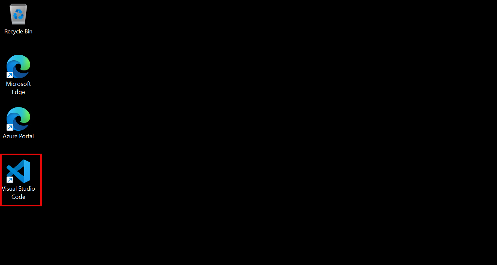


1. The VS Code Welcome page appears once the application starts click on **Open Folder(1)**

    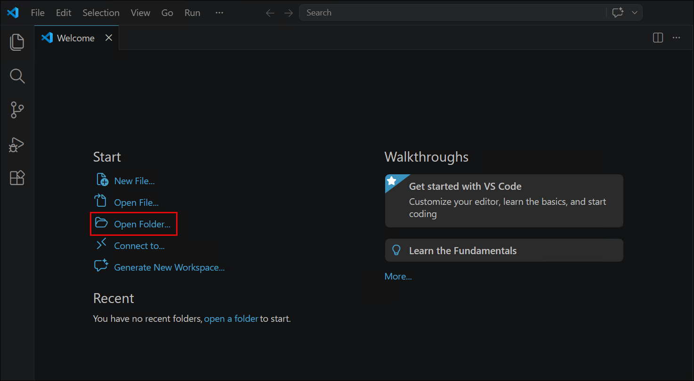


1. Search for **`azure-search-openai-demo (1)`** folder and click **Select folder (2)**.

    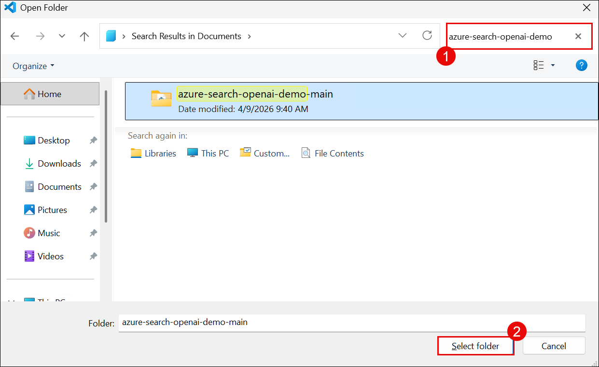

1. 1. If you receive a Do you trust the authors of the files in the folder warning, select the **checkbox (1)** and click **Yes, I trust the authors (2)**.

    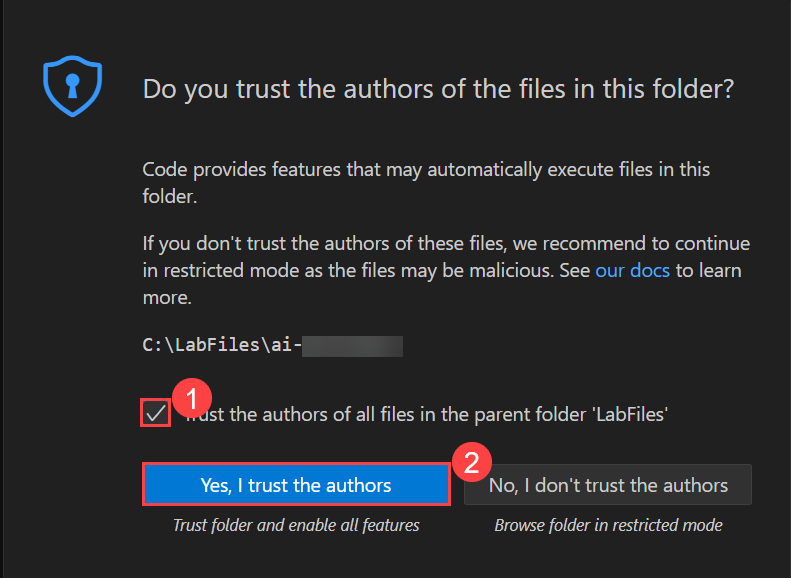

1. Open a **new terminal** from the VS Code **Terminal** menu.

    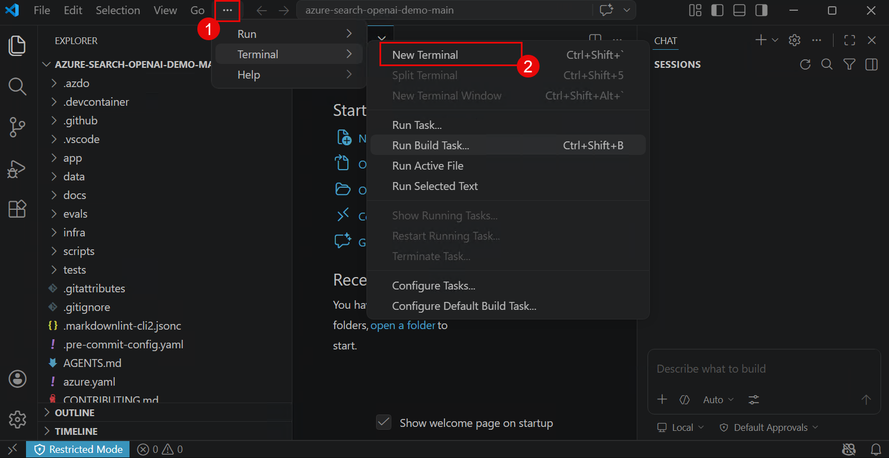

>Use the terminal at the bottom of VS Code to run commands.


## Task 2: Add environment Variables 

In this task, you will configure the necessary environment variables. This involves accessing the environment variables section in the web app settings, editing the values to match those provided in the previous exercise, and saving the changes.

```shell

azd env set AZURE_OPENAI_HOST azure

azd env set AZURE_ENV_NAME <environment-name>

azd env set AZURE_OPENAI_ENDPOINT https://<your-openai-resource-name>.openai.azure.com/

azd env set AZURE_OPENAI_CHATGPT_DEPLOYMENT <chat-model-deployment-name>

azd env set AZURE_OPENAI_EMB_DEPLOYMENT <embedding-model-deployment-name>

azd env set AZURE_SEARCH_SERVICE <search-service-name>

azd env set AZURE_SEARCH_INDEX <index-name>

azd env set AZURE_SEARCH_SEMANTIC_CONFIGURATION default

azd env set AZURE_SEARCH_CONTENT_COLUMNS chunk

azd env set AZURE_SEARCH_TITLE_COLUMN title

azd env set AZURE_SEARCH_VECTOR_COLUMNS text_vector

azd env set AZURE_OPENAI_AUTHENTICATION managedidentity

azd env set AZURE_SEARCH_AUTHENTICATION managedidentity

azd env set AZURE_STORAGE_ACCOUNT <storageaccount-name>

azd env set AZURE_STORAGE_RESOURCE_GROUP <resource-group-name>

azd env set AZURE_STORAGE_SKU  Standard_LRS

```

## Task 3: Deploy the Python Application 

The steps below will provision Azure resources and deploy the application code to Azure Container Apps.

1. Login to your Azure account:

    ```shell
    azd auth login
    ```

1. Create a new azd environment:

    ```shell
    azd env new
    ```
1. Run `azd deploy` will provision Azure resources and deploy this sample to those resources.

    ```shell
    azd deploy
    ```

    - You will be prompted to select two locations, one for the majority of resources and one for the OpenAI resource, which is currently a short list. That location list is based on the availablity and may become outdated as availability changes.


1. After the application has been successfully deployed you will see a URL printed to the console.  Click that URL to interact with the application in your browser.

    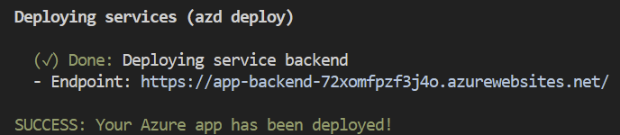

## Navigate to Azure Portal and View Resources

1. Navigate to the Azure portal.

    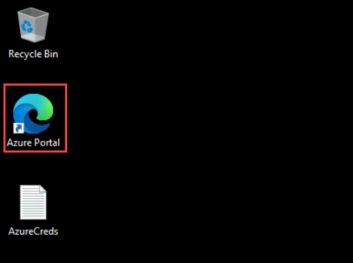

2. In the Azure portal, search for **Resource groups(1)** in the search bar at the top, Click on **Resource group (2)**.

    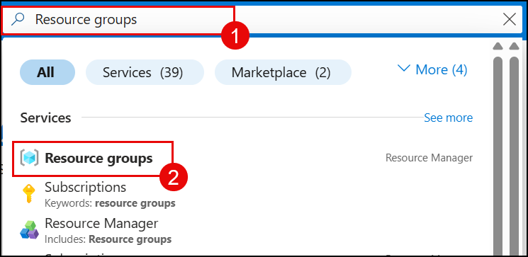

1. Locate and click on your lab's **Resource group**.

     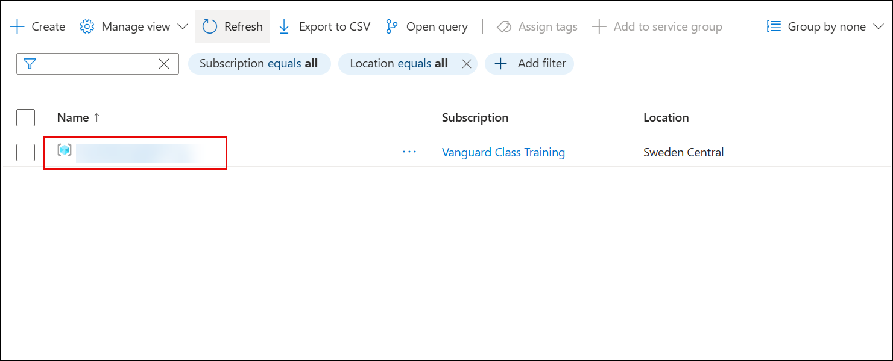

1. Once inside the resource group, you'll see an overview of all the Azure resources that have been pre-provisioned for this lab.

    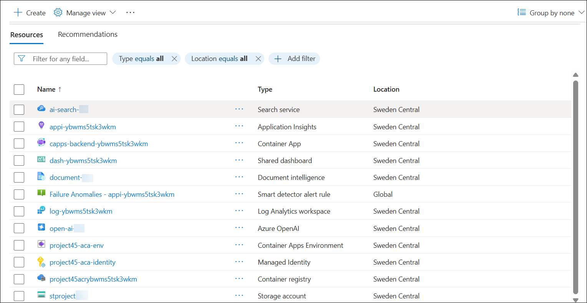

## Summary

In this lab, you have completed the following tasks:

-  Setup the VS Code Environment
-  Add environment Variables 
-  Deploy the Python Application

### You have successfully completed the lab. Click on **Next >>** to proceed with the next Lab.

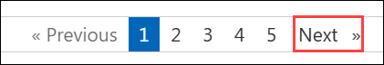