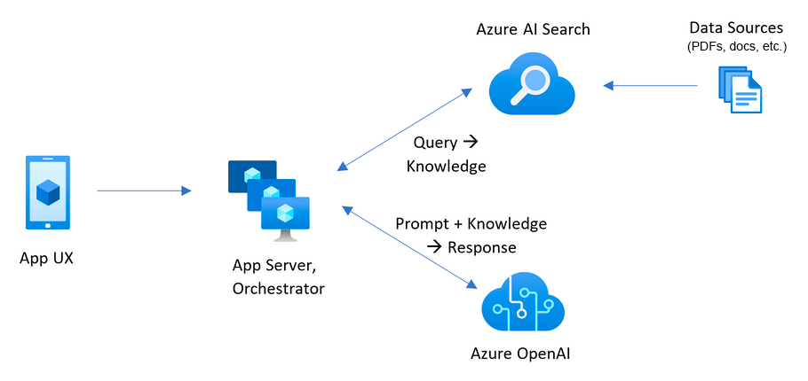

# RAG Chat Application with Azure OpenAI and Azure AI Search

### Overall Estimated Duration: 4 hours

## Overview
 
In this lab, you will build a Retrieval-Augmented Generation (RAG) Chat Application using Azure OpenAI Service, Azure AI Search, and Python.

Traditional Large Language Models (LLMs) generate responses based only on their training data, which can sometimes be outdated or incorrect.

RAG solves this problem by combining:

- Search (retrieving relevant data)
- AI generation (creating responses using that data)

By the end of this lab, you will have built a working Retrieval-Augmented Generation (RAG) chatbot that can answer questions based on your own data. You will also gain practical experience integrating multiple Azure services, including Azure OpenAI and Azure AI Search, to create a complete end-to-end solution. Overall, this lab will provide you with hands-on experience in designing and developing real-world AI applications.

## Objective

This lab is designed to provide hands-on experience in building a Retrieval-Augmented Generation (RAG) application using Azure OpenAI and Azure AI Search to enable intelligent, context-aware question answering.

 - **Build a RAG chat application with Azure OpenAI:** Implement Azure OpenAI Service to generate intelligent, context-aware responses using large language models. Configure and run a client application to process user queries and generate answers based on retrieved data.

- **Retrieve data with Azure AI Search:** Use Azure AI Search to index and search documents efficiently. Configure search indexes and enable keyword and vector-based search to retrieve the most relevant information for user queries.

- **Generate embeddings with Azure OpenAI:** Use embedding models to convert text into numerical vectors. These embeddings help in understanding semantic meaning and are used for performing accurate similarity searches in the RAG pipeline.

- **Perform vector search in Azure AI Search:** Configure vector search capabilities to find relevant documents based on meaning rather than exact keywords. This improves the accuracy and relevance of search results.

- **Integrate Python application for orchestration:** Develop a Python-based client application that connects Azure OpenAI and Azure AI Search. The application handles user input, retrieves relevant documents, sends context to the model, and displays the final response.

- **Implement end-to-end RAG workflow:** Combine retrieval and generation steps to build a complete pipeline where user queries are processed, relevant data is retrieved, and accurate answers are generated using AI models.

## Pre-requisites

Participants should have the following prerequisites:

- **Basic Understanding of Cloud Computing:** Familiarity with fundamental cloud concepts such as resources, resource groups, and services within Microsoft Azure.

- **Knowledge of Azure OpenAI:** Understanding of Azure OpenAI Service, including how to deploy models, use endpoints, and generate responses using large language models.

- **Knowledge of Azure AI Search:** Basic understanding of Azure AI Search, including how to create indexes, store data, and perform search operations (keyword and vector search).

- **Experience with the Azure Portal:** Ability to navigate the Azure Portal to create, configure, and manage resources like Azure OpenAI and Azure AI Search.

- **Basic Python Programming Knowledge:** Understanding of Python basics such as variables, functions, and running scripts, as it will be used to build the RAG application.

- **Familiarity with APIs and SDKs:** Basic knowledge of how APIs work, including making requests, using endpoints, and handling responses in applications.

- **Understanding of JSON Format:** Ability to read and understand JSON data, which is commonly used in API requests and responses.

- **Basic Knowledge of AI Concepts:** General understanding of concepts like embeddings, vector search, and how AI models process text.
## Architecture

In this lab, you will build a Retrieval-Augmented Generation (RAG) chat application by integrating Azure OpenAI and Azure AI Search to enable intelligent, context-aware responses based on your own data. The workflow begins by creating and configuring Azure OpenAI and Azure AI Search resources. You will prepare and upload documents, which are then indexed in Azure AI Search to enable efficient retrieval using both keyword and vector-based search.

Embeddings will be generated using Azure OpenAI to convert text into numerical representations, allowing the system to understand the semantic meaning of user queries and documents. When a user submits a query, the Python application will send it to Azure AI Search, which retrieves the most relevant documents. These results are then passed as context to Azure OpenAI, which generates a meaningful and accurate response.

Throughout the lab, you will integrate all components into a complete workflow, test the application with real queries, and enhance it to simulate a real-world AI-powered chatbot that retrieves, processes, and responds to user queries effectively.
## Architecture Diagram

## Explanation of Components

The architecture for this lab involves the following key components:
- **Azure OpenAI Service:** Azure OpenAI Service provides access to powerful language models that are used to generate intelligent and human-like responses. It processes user queries along with retrieved context and produces accurate answers based on the given data.

- **Azure AI Search:** Azure AI Search is used to store, index, and retrieve documents efficiently. It supports both keyword search and vector (semantic) search to return the most relevant results based on user queries.

- **Python Application:** The Python application acts as the orchestration layer that connects all services. It takes user input, sends queries to Azure AI Search, retrieves relevant results, passes context to Azure OpenAI, and displays the final response.

- **Embeddings:** Embeddings are numerical representations of text that capture the meaning of words and sentences. They are used to compare the similarity between user queries and stored documents for better search results.

- **Vector Search:** Vector search is a technique used to find information based on semantic meaning rather than exact keyword matches. It improves the accuracy and relevance of search results by understanding the intent behind the query.

- **Azure OpenAI Embedding Model:** The embedding model in Azure OpenAI is used to convert text into vector format. These vectors are then stored and used in Azure AI Search to perform similarity-based retrieval.

- **Search Index:** A search index in Azure AI Search is a structured collection of documents that allows fast and efficient querying. It contains fields like content, metadata, and embeddings to support advanced search scenarios.

# Getting Started with Lab
Welcome to your Azure AI agents lab, Let's begin by making the most of this experience:

## Accessing Your Lab Environment
Once you're ready to dive in, your virtual machine and lab guide will be right at your fingertips within your web browser.

## Lab Guide Zoom In/Zoom Out
To adjust the zoom level for the environment page, click the **A↕ : 100%** icon located next to the timer in the lab environment.

**Virtual Machine & Lab Guide**

Your virtual machine is your workhorse throughout the workshop. The lab guide is your roadmap to success.

## Exploring Your Lab Resources

To get a better understanding of your lab resources and credentials, navigate to the **Environment** tab.

## Utilizing the Split Window Feature

For convenience, you can open the lab guide in a separate window by selecting the **Split Window** button from the Top right corner.

## Managing Your Virtual Machine

Feel free to **start, stop, or restart (2)** your virtual machine as needed from the **Resources (1)** tab. Your experience is in your hands!

## Let's Get Started with Azure Portal

1. On your virtual machine, click on the Azure Portal icon.

1. You'll see the **Sign into Microsoft Azure** tab. Here, enter your credentials:

    - **Email/Username:**

1. Next, provide your password:

    - **Password:**

1. If **Action required** pop-up window appears, click on **Ask later**.

1. If prompted to **stay signed in**, you can click **No**.

1. If a **Welcome to Microsoft Azure** pop-up window appears, simply click **"Cancel"** to skip the tour.

