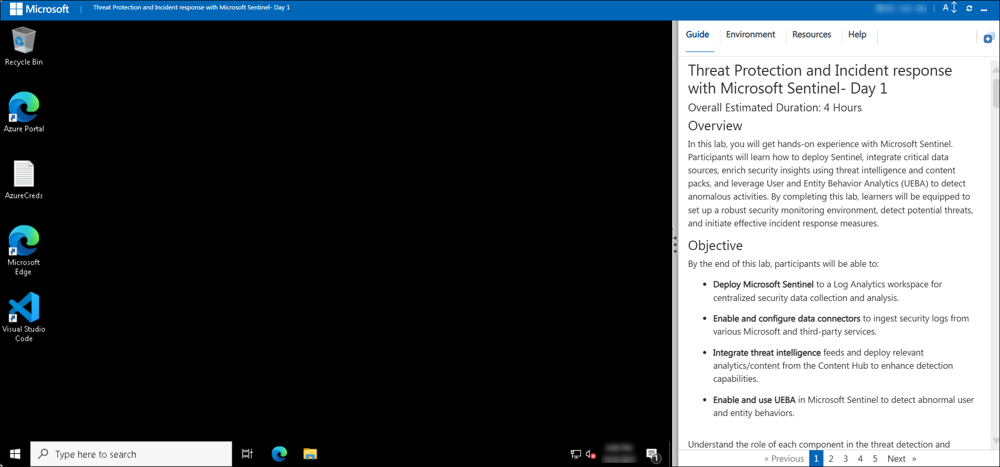
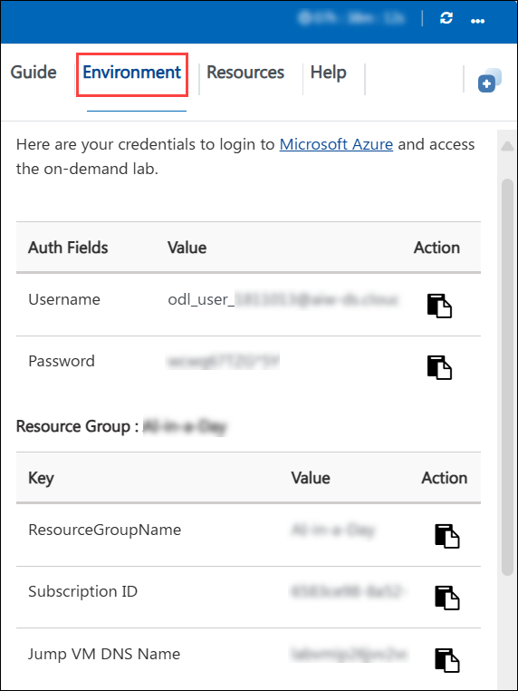
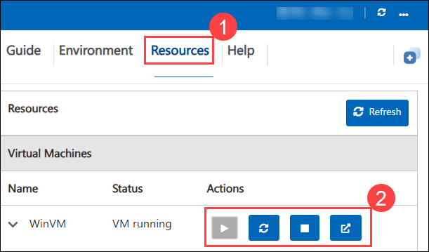

# RAG Chat Application with Azure OpenAI and Azure AI Search (Python)

### Overall Estimated Duration: 4 hours

## Overview
 
In this lab, you will build a Retrieval-Augmented Generation (RAG) Chat Application using Azure OpenAI Service, Azure AI Search, and Python.

Traditional Large Language Models (LLMs) generate responses based only on their training data, which can sometimes be outdated or incorrect.

RAG solves this problem by combining:

- Search (retrieving relevant data)
- AI generation (creating responses using that data)

By the end of this lab, you will have built a working Retrieval-Augmented Generation (RAG) chatbot that can answer questions based on your own data. You will also gain practical experience integrating multiple Azure services, including Azure OpenAI and Azure AI Search, to create a complete end-to-end solution. Overall, this lab will provide you with hands-on experience in designing and developing real-world AI applications.

## Objective

This lab provides hands-on experience in building and deploying a Retrieval-Augmented Generation (RAG) application using Azure AI services. The lab guides learners through setting up required cloud resources, building the RAG pipeline, deploying a Python-based application, and interacting with an AI-powered chat interface.

- **Configure Azure Resources:** This lab begins with configuring the required Azure environment by creating and setting up services such as Azure AI Search, Azure OpenAI Service, and Azure AI Document Intelligence. These resources enable document processing, indexing, and AI-based response generation required for the RAG solution.

- **Build Retrieval-Augmented Generation (RAG) Pipeline:** The lab focuses on developing a RAG workflow that combines document retrieval with AI-based text generation. Text embeddings are generated using Azure OpenAI and stored in Azure AI Search to enable semantic and vector-based search, allowing the system to retrieve relevant content and generate context-aware answers.

- **Retrieve data with Azure AI Search:** Use Azure AI Search to index and search documents efficiently. Configure search indexes and enable keyword and vector-based search to retrieve the most relevant information for user queries.

- **Integrate Python application for orchestration:** Develop a Python-based client application that connects Azure OpenAI and Azure AI Search. The application handles user input, retrieves relevant documents, sends context to the model, and displays the final response.

- **Interact with the Chat Application:** Finally, the deployed chat application is tested by submitting queries and observing AI-generated responses. The application retrieves relevant information from indexed documents and produces accurate, context-aware answers using the complete RAG workflow.

## Pre-requisites

Participants should have the following prerequisites:

- **Basic Understanding of Cloud Computing:** Familiarity with fundamental cloud concepts such as resources, resource groups, and services within Microsoft Azure.

- **Basic Knowledge of AI Concepts:** General understanding of concepts like embeddings, vector search, and how AI models process text.

- **Knowledge of Azure OpenAI:** Understanding of Azure OpenAI Service, including how to deploy models, use endpoints, and generate responses using large language models.

- **Knowledge of Azure AI Search:** Basic understanding of Azure AI Search, including how to create indexes, store data, and perform search operations (keyword and vector search).

- **Experience with the Azure Portal:** Ability to navigate the Azure Portal to create, configure, and manage resources like Azure OpenAI and Azure AI Search.

- **Basic Python Programming Knowledge:** Understanding of Python basics such as variables, functions, and running scripts, as it will be used to build the RAG application.

- **Familiarity with APIs and SDKs:** Basic knowledge of how APIs work, including making requests, using endpoints, and handling responses in applications.

## Architecture

In this lab, you will build a Retrieval-Augmented Generation (RAG) chat application by integrating Azure OpenAI and Azure AI Search to enable intelligent, context-aware responses based on your own data. The workflow begins by creating and configuring Azure OpenAI and Azure AI Search resources. You will prepare and upload documents, which are then indexed in Azure AI Search to enable efficient retrieval using both keyword and vector-based search.

Embeddings will be generated using Azure OpenAI to convert text into numerical representations, allowing the system to understand the semantic meaning of user queries and documents. When a user submits a query, the Python application will send it to Azure AI Search, which retrieves the most relevant documents. These results are then passed as context to Azure OpenAI, which generates a meaningful and accurate response.

Throughout the lab, you will integrate all components into a complete workflow, test the application with real queries, and enhance it to simulate a real-world AI-powered chatbot that retrieves, processes, and responds to user queries effectively.

## Architecture Diagram

## Explanation of Components

The architecture for this lab involves the following key components:
- **Azure OpenAI Service:** Azure OpenAI Service provides access to powerful language models that are used to generate intelligent and human-like responses. It processes user queries along with retrieved context and produces accurate answers based on the given data.

- **Azure AI Search:** Azure AI Search is used to store, index, and retrieve documents efficiently. It supports both keyword search and vector (semantic) search to return the most relevant results based on user queries.

- **Azure OpenAI Embedding Model:** The embedding model in Azure OpenAI is used to convert text into vector format. These vectors are then stored and used in Azure AI Search to perform similarity-based retrieval.

- **Search Index:** A search index in Azure AI Search is a structured collection of documents that allows fast and efficient querying. It contains fields like content, metadata, and embeddings to support advanced search scenarios.

- **Python Application:** The Python application acts as the orchestration layer that connects all services. It takes user input, sends queries to Azure AI Search, retrieves relevant results, passes context to Azure OpenAI, and displays the final response.

# Getting Started with Lab
Welcome to your Azure AI agents lab, Let's begin by making the most of this experience:

## Accessing Your Lab Environment
Once you're ready to dive in, your virtual machine and lab guide will be right at your fingertips within your web browser.

## Lab Guide Zoom In/Zoom Out
To adjust the zoom level for the environment page, click the **A↕ : 100%** icon located next to the timer in the lab environment.

**Virtual Machine & Lab Guide**

Your virtual machine is your workhorse throughout the workshop. The lab guide is your roadmap to success.

## Exploring Your Lab Resources

To get a better understanding of your lab resources and credentials, navigate to the **Environment** tab.

## Utilizing the Split Window Feature

For convenience, you can open the lab guide in a separate window by selecting the **Split Window** button from the Top right corner.

## Managing Your Virtual Machine

Feel free to **start, stop, or restart (2)** your virtual machine as needed from the **Resources (1)** tab. Your experience is in your hands!

## Let's Get Started with Azure Portal

1. On your virtual machine, click on the Azure Portal icon.

2. You'll see the **Sign into Microsoft Azure** tab. Here, enter your credentials:

    - **Email/Username:**

3. Now enter the Temporary Access Pass and click on **Sign in**

    - **Enter Temporary Access Pass:**

4. If Action required pop-up window appears, click on **Ask later**.

5. If prompted to **stay signed in**, you can click **No**.

6. If a **Welcome to Microsoft Azure** pop-up window appears, simply click **"Cancel"** to skip the tour.

## Support Contact
 
The CloudLabs support team is available 24/7, 365 days a year, via email and live chat to ensure seamless assistance at any time. We offer dedicated support channels tailored specifically for both learners and instructors, ensuring that all your needs are promptly and efficiently addressed.

Learner Support Contacts:
- Email Support: cloudlabs-support@spektrasystems.com
- Live Chat Support: https://cloudlabs.ai/labs-support

Now, click on **Next** from the lower right corner to move on to the next page.
 

### Happy Learning!!

